<h1 align="center">Hi 👋, I'm Uzair Khan</h1>

<h3 align="center">
  Computer Science Student • Software Developer • AI Enthusiast
</h3>

  <i>Learning, building, and solving problems one project at a time.</i>

  

  
  

---

## 👨‍💻 About Me

I'm a **Computer Science student** interested in **AI and software development**.

Currently, I'm improving my **Data Structures & Algorithms**, exploring **Machine Learning**, and building projects to strengthen my programming and problem-solving skills.

- 🔭 Currently working on **[DSA](https://github.com/khanuzair-f15/DSA)**
- 🌱 Currently learning **PyTorch, Pandas, SQL & Seaborn**
- 🧠 Improving my **DSA & problem-solving skills**
- 🤖 Exploring **AI / Machine Learning**
- 💻 Interested in **Software Development & IoT**
- 🚀 Learning by building projects
- 📫 **khanuzair.work@gmail.com**

---

## 🛠️ Languages & Tools

---
 

# 📊 GitHub Analytics

  

  

---

# 🔥 Contribution Streak

  

---
 
# 📈 Contribution Activity

  

 
---

 
 
---
# 🧩 LeetCode

  

---

# 🚀 Featured Projects

---

# 📚 Currently Learning

---

# 🐍 Contribution Snake

  <picture>
    <source
      media="(prefers-color-scheme: dark)"
      srcset="https://raw.githubusercontent.com/khanuzair-f15/khanuzair-f15/output/github-contribution-grid-snake-dark.svg"
    />
    <source
      media="(prefers-color-scheme: light)"
      srcset="https://raw.githubusercontent.com/khanuzair-f15/khanuzair-f15/output/github-contribution-grid-snake.svg"
    />
    
  </picture>

---

# 🌐 Connect With Me

---

  <i>Keep learning. Keep building. Keep improving. 🚀</i>

  ⭐ Feel free to explore my repositories!

